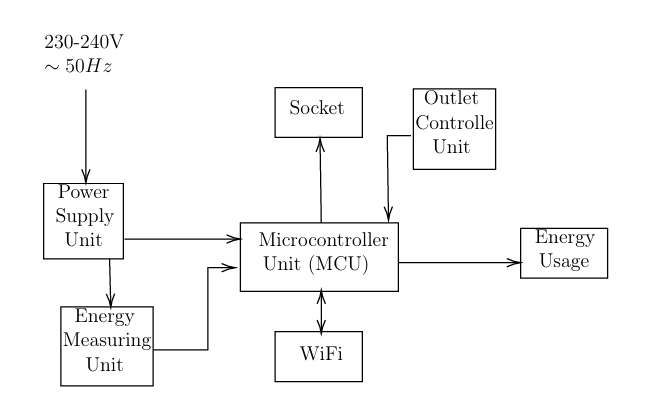
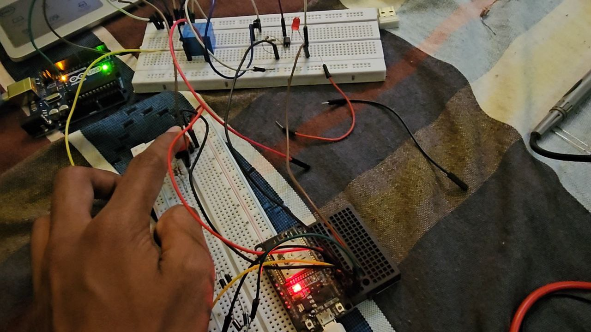
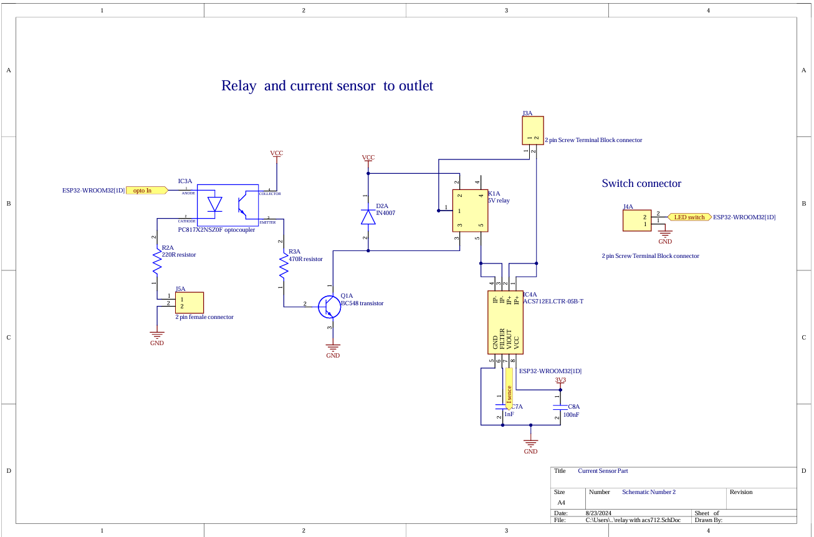
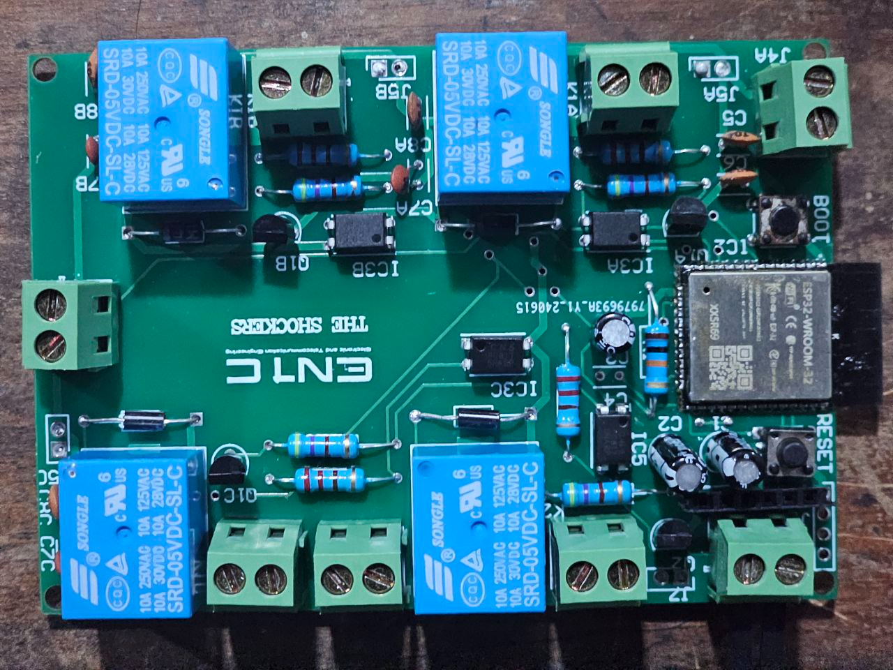
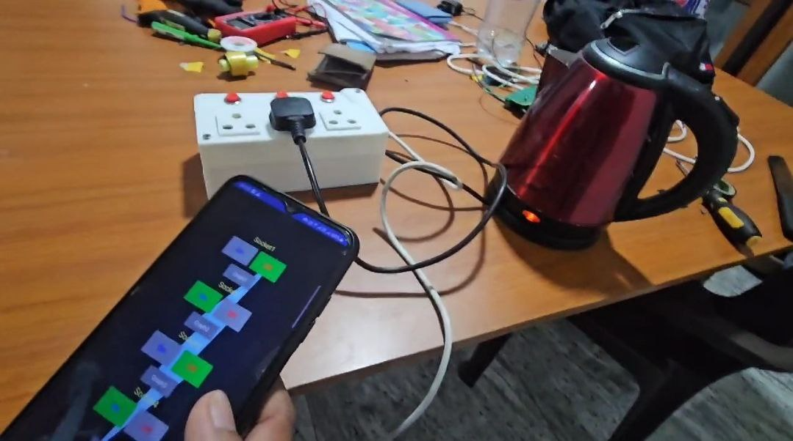
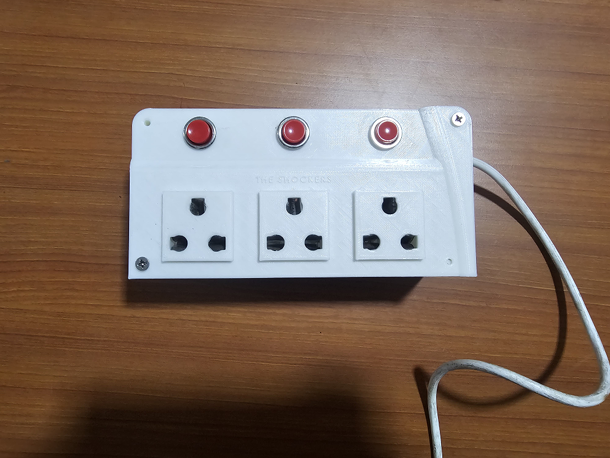

# Smart Multi-Outlet System

## Overview

Smart Multi-Outlet is a hardware and software integrated project designed to allow users to control and monitor multiple AC power outlets remotely. It provides real-time feedback on current consumption, protects against overload, and supports automation through microcontroller-based control.

This project aims to improve energy efficiency, safety, and convenience in both household and industrial environments.This project implements a **Smart Multi-Outlet** power strip, enabling multiple electrical devices to be individually monitored and controlled for safety, automation, and energy efficiency. The primary focus is on reliable **circuit design, assembly, and practical testing** to ensure robust operation in real-world conditions.

## Features

- **Individual outlet control** for each socket  
- Manual and remote switching capability (via App)
- Real-time current monitoring per outlet
- Overcurrent and overload protection
- Indicator LEDs for operational status
- Tested relay-driven switching for AC loads
- Modular, easily serviceable PCB design

## Project Highlights

- **Circuit Design:**  
  Designed, simulated, and assembled the entire outlet control circuitry with precision PCB layout and component selection.
- **Testing & Validation:**  
  Performed systematic testing for functional correctness, reliability, and safety, including live-load trials and troubleshooting.
- **Documentation:**  
  Kept detailed notes on circuit diagrams, PCB revisions, and encountered challenges to facilitate reproducibility and future enhancements.

---

## Table of Contents

- [Overview](#overview)
- [Features](#features)
- [Project Highlights](#project-highlights)
- [System Diagram](#system-diagram)
- [Circuit Diagram](#circuit-diagram)
- [PCB & Assembly](#pcb--assembly)
- [Testing](#testing)
- [Usage](#usage)

---

## System Diagram

    

&nbsp;

---

## Circuit Diagram
Primary Circuit Test

    

 

Schematics

    

 

&nbsp;

---

## PCB & Assembly

    

 

Each outlet is controlled through an isolated relay, driven by the microcontroller. 
Current sensors are placed inline with each outlet to monitor the current consumption. Overload protection logic is implemented via software thresholds.

&nbsp;

---

## Testing

    

- Each channel/outlet tested under rated AC load conditions
- Verified isolation and safe relay actuation
- Fault protection tested using simulated overloads
- Stability confirmed across extended operation

&nbsp;
---

## Final Product

    

 

---

## Usage

1. **Connect** the device to an AC mains supply.
2. **Plug** the appliances/devices into the individual outlets.
3. **Operate** each switch (manual/remote) to control power delivery to each outlet and measure power delivary.
4. **Monitor** status via indicator LEDs for safety and feedback.

---

## License

This project is open-source and available under the MIT License.
